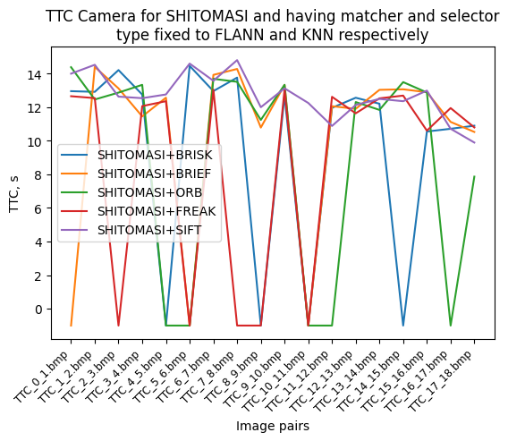
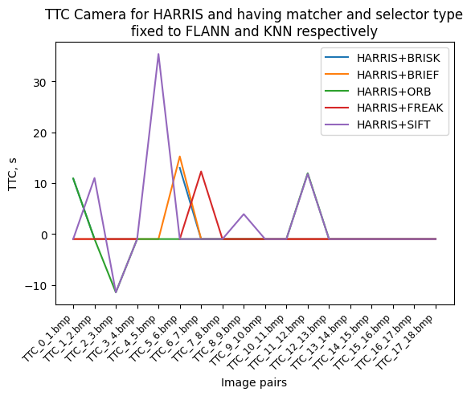
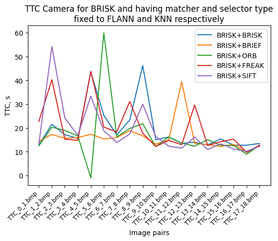
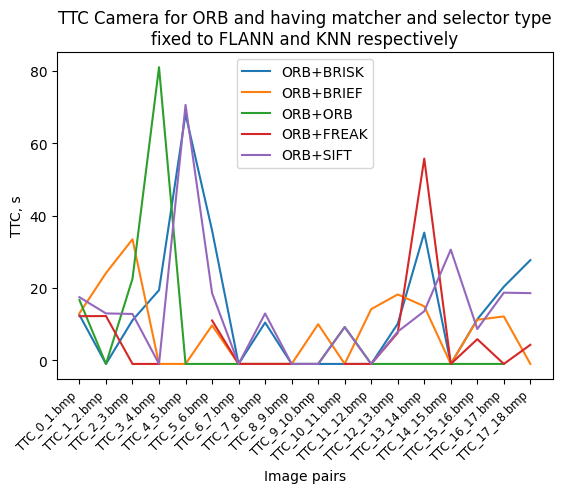
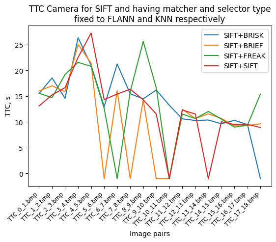

## Results

This is the conclusion results based on the exercises in the final project.

### 3D Object matching
Using YOLO to identify objects in the frame was quite straightforward. Afterwards, we loop through keypoint matches per bounding box in current and previous frame and take the ones that have the highest amount of matches per bounding box.

### Lidar TTC
The TTC for the lidar is calculated using constant velocity model by taking the difference in distance, between previous and current frames, of the closest point to the lidar, in this case point in X axis as it corresponds to Lidar orientation. To remove outliers, I have used MADS approach to calculated a z-score for each point and not to include for the calculation if their score exceeds 3 times the median z-score.

### Keyppoint Correspondences with Bounding Box association
Similarly to second exercise, I cycle through keypoint matches between previous and current frames and calculate Euclidean distance between them and store in a vector. This I then pass to already used MADS calculation to get the z-score. Last step is to iterate over the keypoint matches again to remove the ones that are outliers (not to included them in the bounding box) if their distance between previous and current frame keypoints is above 3 times z-score.

### Camera based TTC
The camera based TTC calculation is based on the one used in the exercises previously during the course but has an addition of taking into account the outliers, again discarding the ones that are above 3 times MADS z-score and a new median distRatio is used for the TTC.

### Investigate Lidar based TTC

The lidar results are unrelated to what camera algorithms are used for detecting keypoints in the image,
thus only one set can be used to depict the sample results.

Figure 1: TTC of Lidar throughout the image sequence is the red line and calculated distance to target are green x's. 
  
  
As can be seen in Figure 1, the distance to the car in front decreases as the image sequence goes through the list, which is what to be expected from distance calculation for TTC. However, the actual time to collision changes between the image pairs as go through the list of them. This is to be expected as we are using delta in distance between the two images rather than taking into account the previous motion as well as TTC calculation formula which expects constant velocity between frames. This is particularly the problem when the distance to the vehicle decreased more/less compared to previous image pairs. For example in image pair TTC_4_5 and TTC_5_6 the TTC jump is almost 4s because of significant change in distance delta which is not linear what constant velocity model expects. Due to this, the constant velocity TTC calculation breaks and we have these significant jumps in TTC.

Table 1: Lidar TTC, distance to car and distance delta between image pairs.

| Image pairs   | TTC Lidar, s | Lidar distance to car, m | Distance Delta, m |
|---------------|--------------|--------------------------|-------------------|
| TTC_0_1.bmp   | 12.3137      | 8.004                    | 0                 |
| TTC_1_2.bmp   | 11.6706      | 7.936                    | -0.068            |
| TTC_2_3.bmp   | 15.7721      | 7.886                    | -0.05             |
| TTC_3_4.bmp   | 16.6787      | 7.839                    | -0.047            |
| TTC_4_5.bmp   | 15.5779      | 7.789                    | -0.05             |
| TTC_5_6.bmp   | 11.8831      | 7.724                    | -0.065            |
| TTC_6_7.bmp   | 11.7831      | 7.659                    | -0.065            |
| TTC_7_8.bmp   | 13.5768      | 7.603                    | -0.056            |
| TTC_8_9.bmp   | 13.9795      | 7.549                    | -0.054            |
| TTC_9_10.bmp  | 11.5139      | 7.484                    | -0.065            |
| TTC_10_11.bmp | 12.5847      | 7.425                    | -0.059            |
| TTC_11_12.bmp | 8.73927      | 7.341                    | -0.084            |
| TTC_12_13.bmp | 9.95617      | 7.268                    | -0.073            |
| TTC_13_14.bmp | 9.72157      | 7.194                    | -0.074            |
| TTC_14_15.bmp | 8.16898      | 7.107                    | -0.087            |
| TTC_15_16.bmp | 10.3515      | 7.039                    | -0.068            |
| TTC_16_17.bmp | 9.16182      | 6.963                    | -0.076            |
| TTC_17_18.bmp | 8.82697      | 6.885                    | -0.078            |
  

Figure 2: Topdown view of image 4. 

  

Figure 3: Topdown view of image 5. 

  

Figure 4: Topdown view of image 6. 

  
If we would look at Figures 2-4, we can see that the pointcloud in those top down views is consistent between frames, which means that distance detection to the car in front is correct in this sequence. The problem is the calculation of the TTC. This could be improved by having a filter that takes vehicle motion history for this and that would drastically improve the calculation by removing huge jumps in TTC.
  
To sum up, the data shown above shows that it is possible to detect a distance change to the obstacle in front rather accurately using only lidar, however using constant velocity model for TTC calculation is a poor approach for any sensor data analysis. Having more robust calculation, that takes into account motion history and acceleration is necessary. However, in that case it would require extra sensor input which is not what this performance evaluation was about.

### Investigate TTC Camera performance

The TTC for the camera is calculated using bounding box size change ratio rather than distance to the car in front. This is still using constant velocity model so time jump are also to be expected as in lidar case. Additionally, if the change in distance between keypoints is minimal, it can result in undefined/unreasonable TTC results. For only focusing on descriptor+detector pairs, the matcher and selector are fixed for MAT_FLANN and SEL_KNN to represent closer what is the industry using. The following figures show TTC results for different detectors and their pairings with the descriptors.
  

Figure 5: TTC Camera times for SHITOMASI detector. 

  

Figure 6: TTC Camera times for HARRIS detector. 

  

Figure 7: TTC Camera times for AKAZE detector. 

  

Figure 8: TTC Camera times for BRISK detector. 

  

Figure 9: TTC Camera times for FAST detector. 

  

Figure 10: TTC Camera times for ORB detector. 

  

Figure 11: TTC Camera times for SIFT detector. 

  
<em><strong>NOTE: All values that were reported as 'nan' by TTC were put as -1 in the graphs.</em></strong>
  
From the graphs above it can be seen that HARRIS, ORB and FAST detectors performed the worst as they had the biggest jumps in TTC as well as most 'nan' values when calculating the TTC. This is a result of failing to find matching keypoint pairs in the bounding box that are not the outliers, because the bounding box itself is not limited on the vehicle shape. Similarly could be the case in high TTC calculation because the selected keypoint pair for TTC calculation was not from the ego car but from other part of the environment that managed to get included in the bounding box. This is particularly the case in ORB and SIFT detectors as in some cases the TTC goes beyond 80s!. AKAZE detector showed more or less consistent output, however, compared to Lidar TTC, the TTC values are almost double per each image pair.
  
Compared to Lidar TTC, the jumps are far more significant and show the unreliability of using this approach for the constant velocity model. Nevertheless, the most consistent pair of detector+descriptor is SHITOMASI detector with SIFT descriptor. 
